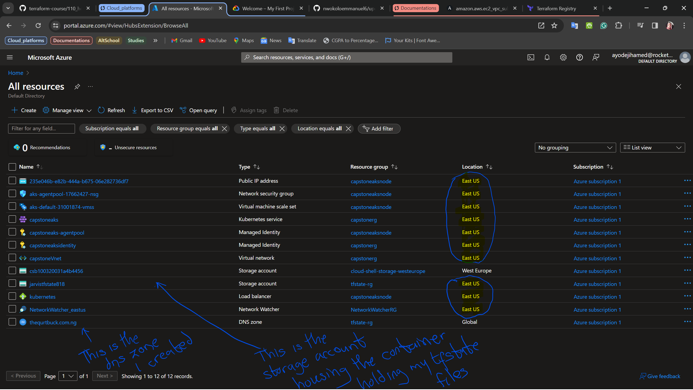
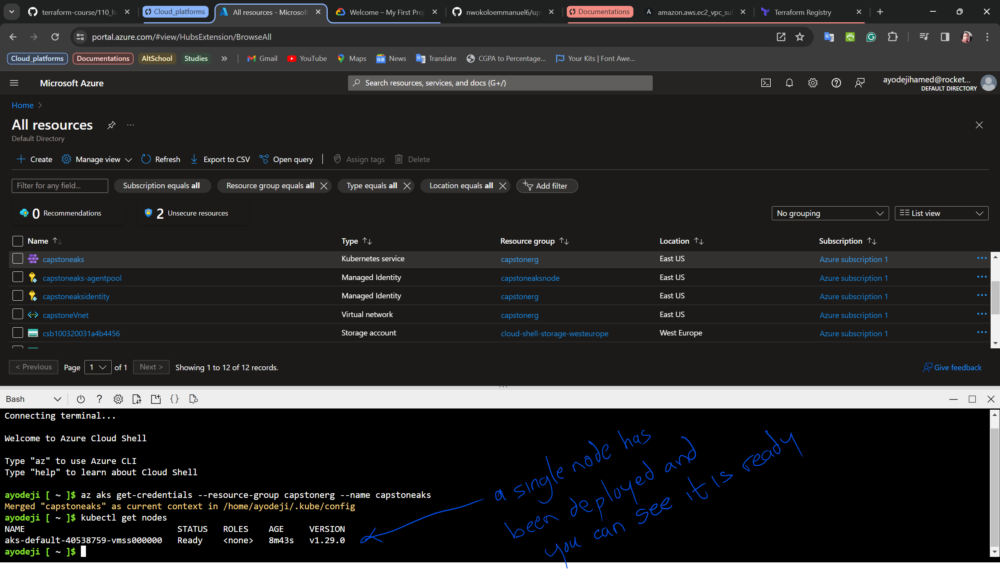

# INFRASTRUCTURE

## Overview

This directory contains the infrastructure code for the AKS cluster and the Azure resources that are used by the application. The infrastructure is defined using Terraform and the code is organized in a way that makes it easy to understand and maintain. It comprises the 
following modules:

- `rg`: This module is responsible for creating the resource group that contains the AKS cluster and the associated resources. In Azure, a resource group is a logical container that holds related resources, such as virtual machines, storage accounts, and databases, etc. This module creates a resource group with the specified name and location. And this module is used by the other modules to create the resources in the same resource group.

- `vn`: This module is responsible for creating the virtual network that is used by the AKS cluster and the associated resources. The virtual network is a representation of the network in the cloud. It is a logical isolation of the Azure cloud dedicated to your subscription. This module creates a virtual network with the specified name and address space. It is from this network, the subnets are created and used by the AKS cluster and the associated resources.

- `subnet`: This module is responsible for creating the subnets that are used by the AKS cluster and the associated resources. A subnet is a range of IP addresses in the VNet. It is used to divide the VNet into smaller networks. This module creates the subnets with the specified name and address space. It is from these subnets, the AKS cluster and the associated resources are created. In Azure, all subnets have access to the internet by default, this is because by default, Azure assigns a route table to each subnet, and that route table contains a default route that sends traffic to the internet. This module creates 2 subnets, one for the AKS cluster and the other for the associated resources.

- `aks`: This module is responsible for creating the AKS cluster and the associated resources, such as the managed identity, the network policies, and the default node pool. it creates an Azure assigned identity for the AKS cluster and assigns the necessary permissions to it, In this case we assigned the role of a "Network Contributor" to the identity. It also creates the AKS cluster with the specified name, location, and the network profile. The network profile is used to configure the network policies for the AKS cluster. The network policies are used to control the traffic flow between the pods and the nodes in the AKS cluster. It also creates the default node pool with the specified name, size, and count. The default node pool is used to run the system pods and the user pods in the AKS cluster. It is from this node pool, the pods are created and scheduled. Autoscaling is also enabled for the default node pool, this is to ensure that the AKS cluster can automatically adjust the number of nodes in the default node pool based on the resource usage.

## Prerequisites

- [Terraform](https://www.terraform.io/downloads.html)
- [Azure CLI](https://docs.microsoft.com/en-us/cli/azure/install-azure-cli)
- [kubectl](https://kubernetes.io/docs/tasks/tools/install-kubectl/)

## Key notes

- Behind the scenes, I already have an Azure subscription and I have already logged in to the Azure CLI using the `az login` command. I have also set the default subscription using the `az account set --subscription` command. This is to ensure that the Terraform code can interact with the Azure subscription.

- The terraform state is stored in an Azure Storage Account. This is to ensure that the state is durable and can be shared across the team. The state is stored in a blob container in the storage account. The state is also locked to prevent concurrent modifications. This is to ensure that the state is not corrupted. This storage account will be used across every terraform script within this project.

- An Azure DNS zone has also been created to provide a domain name for the AKS cluster. This is to ensure that the AKS cluster can be accessed using a domain name. The DNS zone is used to map the domain name to the public IP address of the AKS cluster. This DNS zone will be used across every terraform script within this project. This was done before hand to ensure that the DNS zone is available when the AKS cluster is created. The Nameservers of the DNS zone are also used to configure the domain name in the domain registrar. This is to ensure that the domain name can be resolved to the public IP address of the AKS cluster.

## Testing

- To test the infrastructure code, you can run the following commands:

  ```bash
  cd Infrastructure
  terraform init
  terraform plan
  terraform apply -auto-approve
  ```

- The `terraform init` command is used to initialize the working directory and to download the provider plugins. The `terraform plan` command is used to create an execution plan. The `terraform apply` command is used to apply the changes required to reach the desired state of the configuration.

- After running the above commands, you should see the infrastructure being created in the Azure portal. You should see the resource group, the virtual network, the subnets, and the AKS cluster being created. You should also see the state being stored in the Azure Storage Account. Here is a screenshot of the infrastructure created in the Azure portal after running the above commands:

  

- To test the AkS cluster, you can run the following commands:

  ```bash
  az aks get-credentials --resource-group <resource-group-name> --name <aks-cluster-name>
  kubectl get nodes
  ```

- The `az aks get-credentials` command is used to get the access credentials for the AKS cluster. The `kubectl get nodes` command is used to list the nodes in the AKS cluster. Here is a screenshot of the nodes in the AKS cluster after running the above commands:

  

## Cleanup

- To clean up the resources, you can run the following commands:

  ```bash
  terraform destroy -auto-approve
  ```

## Conclusion

The infrastructure was deployed successfully and the AKS cluster will be the infrastructure where the sock-shop microservice application will be deployed on as well as all the monitoring and logging tools.
