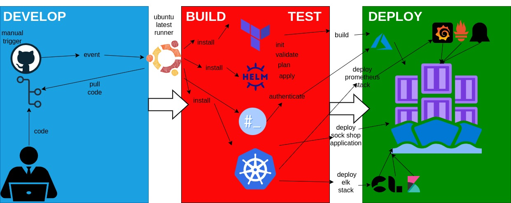

# CapstoneSphere-Microverse

This is my AltSchool V2 Capstone project

## Introduction

This project uses GitHub Actions to create an Azure AKS cluster using Terraform, deploys a microservice application in this case the Sock Shop microservice application, and deploys monitoring and logging tools such as Prometheus, Grafana, Alert Manager, and the ELK stack to the AKS cluster. The project also uses Let's Encrypt to provide SSL certificates for the Sock Shop application.

This project puts together some of the skills I have learned in the DevOps/Cloud Engineering program at AltSchool Africa. It covers the following areas:

- Infrastructure as Code (IaC) using Terraform

- Continuous Integration/Continuous Deployment (CI/CD) using GitHub Actions

- Kubernetes for deploying and managing containerized applications

- Monitoring and Logging using Prometheus, Grafana, Alert Manager, and the ELK stack

- SSL certificates using Let's Encrypt

- Infrastructure as a Service (IaaS) using Azure

## Project Structure

The project is structured as follows:

- `.github/workflows`: This directory contains the GitHub Actions workflow configuration files for deploying the infrastructure and applications to Azure. Detailed Documentation of the workflow steps can be found in the [`README.md`](.github/workflows/README.md) file.

- `infrastructure`: This directory contains the Terraform configurations for creating the Azure AKS cluster. The configurations are used to create the AKS cluster. The detailed documentation of the infrastructure setup can be found in the [`README.md`](infrastructure/README.md) file.

- `helm_charts`: This directory contains the Terraform configurations that use the Helm provider to deploy Helm charts to the AKS cluster. The configurations are used to deploy the Helm charts for cert-manager and Argo CD. The detailed documentation of the Helm charts setup can be found in the [`README.md`](helm_charts/README.md) file.

- `microservices`: This directory contains the YAML files for deploying the Sock Shop microservice application to the AKS cluster. The detailed documentation of the microservices setup can be found in the [`README.md`](microservices/README.md) file.

- `ingress`: This directory contains the YAML files for deploying the NGINX Ingress controller to the AKS cluster. The detailed documentation of the NGINX Ingress setup can be found in the [`README.md`](ingress/README.md) file. The images of the deployed sock-shop microservices application can be found in the readme file.

- `letsencrypt`: This directory contains the Terraform configurations for creating the Let's Encrypt SSL certificates. The configurations are used to create the SSL certificates for the Sock Shop application. The detailed documentation of the Let's Encrypt setup can be found in the [`README.md`](letsencrypt/README.md) file.

- `prometheus_stack`: This directory contains the YAML files for deploying the Prometheus stack components to the AKS cluster. The detailed documentation of the Prometheus stack setup can be found in the [`README.md`](prometheus_stack/README.md) file.

- `elk_stack`: This directory contains the YAML files for deploying the ELK stack components to the AKS cluster. The detailed documentation of the ELK stack setup can be found in the [`README.md`](elk_stack/README.md) file.

- `tester`: This was just a test workspace to test the deployment of the sock-shop microservices application to the AKS cluster. you can also find a detailed documentation of the test setup in the [`README.md`](tester/README.md) file.

## Prerequisites

To run this project, you need the following tools:

- [Terraform](https://www.terraform.io/downloads.html)

- [Azure CLI](https://docs.microsoft.com/en-us/cli/azure/install-azure-cli)

- [kubectl](https://kubernetes.io/docs/tasks/tools/install-kubectl/)

- [Helm](https://helm.sh/docs/intro/install/)

- [GitHub account](https://github.com/)

- [Azure account](https://azure.microsoft.com/en-us/free/)

- [Docker](https://docs.docker.com/get-docker/)

- [AWS account](https://aws.amazon.com/) (Optional) - Only for the test workspace

## Architecture

The architecture of the project is as follows:

1. From a local workstation, the user pushes the code to the GitHub repository.

2. GitHub Actions is triggered manually with the build action.

3. This triggers an event that creates a runner in the GitHub Actions environment.

4. The runner clones the repository to get the files that it will use for the job.

5. The runner then installs the necessary tools such as Terraform, Azure CLI, kubectl, Helm, etc.

6. The runner then logs in to Azure using the Azure CLI.

7. The runner then initializes and applies the Terraform configurations for infrastructure provisioning.

8. The runner then waits for the Kubernetes cluster to be ready.

9. The runner then retrieves the AKS credentials to interact with the Kubernetes cluster.

10. Then it starts to deploy the various components to the AKS cluster such as the Helm charts, the microservices, the NGINX Ingress controller, the Prometheus stack, the ELK stack, and the Let's Encrypt SSL certificates.

## Contributing

Contributions are welcome. You can contribute to this project by forking this repository, making changes, and submitting a pull request. For major changes, please open an issue first to discuss what you would like to change.

## Conclusion

This project is a demonstration of how to use GitHub Actions to deploy an AKS cluster to Azure, deploy a microservice application, and deploy monitoring and logging tools to the AKS cluster. The project also demonstrates how to use Let's Encrypt to provide SSL certificates for the microservice application.

The project is a good starting point for anyone who wants to learn how to deploy applications to Kubernetes and how to set up monitoring and logging tools for the applications.
