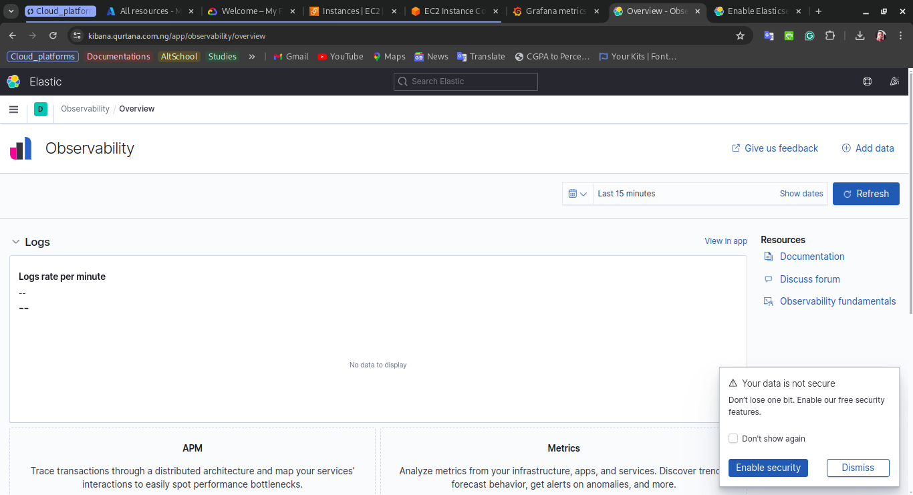

# ELK Stack Deployment on Azure Kubernetes Service (AKS)

This directory contains manifest files for deploying the ELK stack components to an Azure Kubernetes Service (AKS) cluster. The ELK stack components include:

- [Elasticsearch](https://www.elastic.co/elasticsearch/)
- [Logstash](https://www.elastic.co/logstash/)
- [Kibana](https://www.elastic.co/kibana/)
- [Filebeat](https://www.elastic.co/beats/filebeat/)

## Elasticsearch

The Elasticsearch instance is used to store the logs collected by Filebeat. The Elasticsearch instance is configured with the necessary indices and mappings to store the logs.

## Logstash

The Logstash instance is used to collect the logs from the applications running in the Kubernetes cluster. The Logstash instance is configured with the necessary input, filter, and output plugins to collect, parse, and send the logs to the Elasticsearch instance.

## Kibana

The Kibana instance is used to visualize the logs collected by Filebeat and stored in the Elasticsearch instance. The Kibana instance is configured with the necessary index patterns and visualizations to visualize the logs.

### Image of the Kibana instance after deployment

## Filebeat

The Filebeat instance is used to collect the logs from the applications running in the Kubernetes cluster. The Filebeat instance is configured with the necessary inputs and outputs to collect and send the logs to the Logstash instance.

All together, the ELK stack components are used to collect, parse, store, and visualize the logs from the applications running in the Kubernetes cluster.
