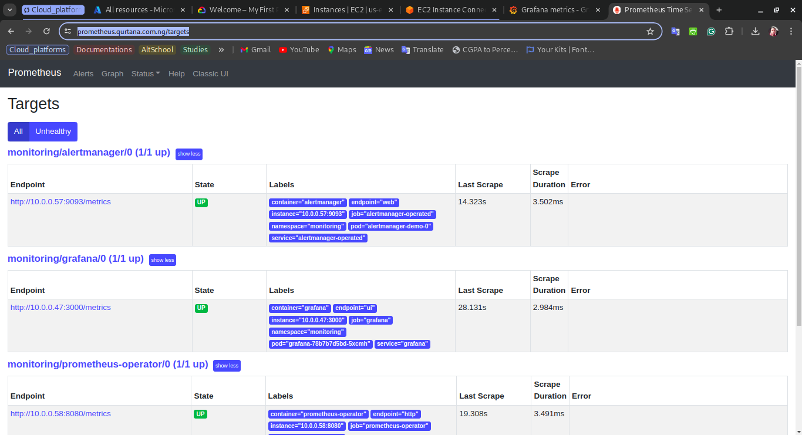
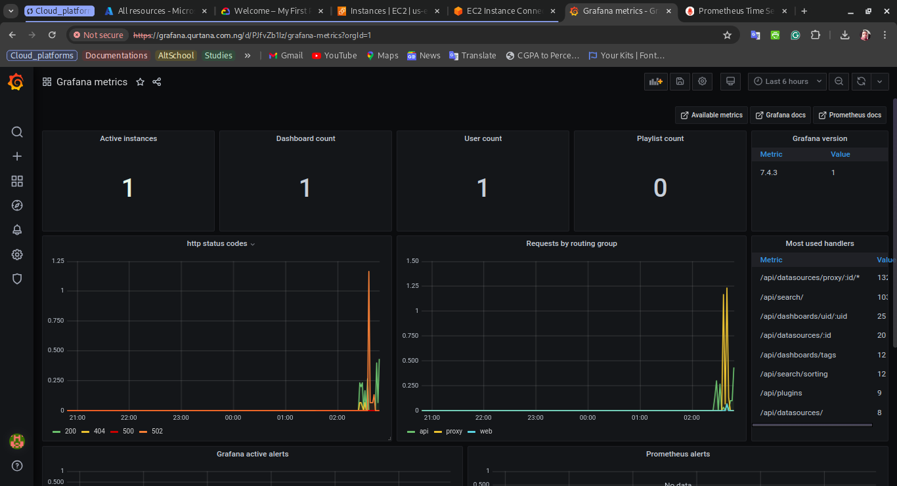
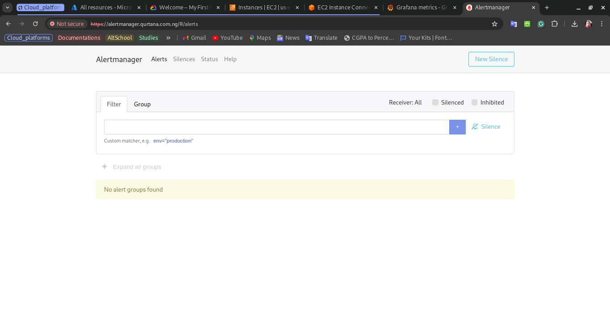

# Prometheus Stack Deployment on Azure Kubernetes Service (AKS)

This directory contains manifest files for deploying the Prometheus stack components to an Azure Kubernetes Service (AKS) cluster. The Prometheus stack components include:

- [Prometheus](https://prometheus.io/docs/introduction/overview/)

- [Grafana](https://grafana.com/docs/grafana/latest/)

- [Alert Manager](https://prometheus.io/docs/alerting/alertmanager/)

## crds

The `crds` directory contains manifest files for the custom resource definitions (CRDs) required by the Prometheus Operator. The CRDs are used to define the custom resources that are managed by the Prometheus Operator. The CRDs are used to define the following custom resources:

- `Prometheus`: This custom resource is used to define the Prometheus instance. The Prometheus instance is used to scrape the metrics from the applications running in the Kubernetes cluster. The Prometheus instance is configured with the necessary rules and alerts to monitor the applications.

- `ServiceMonitor`: This custom resource is used to define the ServiceMonitor instance. The ServiceMonitor instance is used to define the endpoints that should be scraped by the Prometheus instance. The ServiceMonitor instance is used to define the labels that should be used to select the endpoints to be scraped.

- `Alertmanager`: This custom resource is used to define the Alertmanager instance. The Alertmanager instance is used to define the alerts that should be sent to the receivers. The Alertmanager instance is configured with the necessary rules and receivers to send the alerts.

- `AlertmanagerConfig`: This custom resource is used to define the Alertmanager configuration. The Alertmanager configuration is used to define the routes and the receivers that should be used to send the alerts.

- `PodMonitor`: This custom resource is used to define the PodMonitor instance. The PodMonitor instance is used to define the pods that should be scraped by the Prometheus instance. The PodMonitor instance is used to define the labels that should be used to select the pods to be scraped.

- `PrometheusRule`: This custom resource is used to define the Prometheus rule. The Prometheus rule is used to define the rules that should be evaluated by the Prometheus instance. The Prometheus rule is used to define the alerts that should be sent to the Alertmanager instance.

- `Probe`: This custom resource is used to define the Probe instance. The Probe instance is used to define the probes that should be evaluated by the Prometheus instance. The Probe instance is used to define the labels that should be used to select the probes to be evaluated.

## Prometheus-operator

The `Prometheus-operator` directory contains manifest files for deploying the Prometheus Operator to the Kubernetes cluster. The Prometheus Operator is used to manage the Prometheus instances, the ServiceMonitor instances, the Alertmanager instances, the Alertmanager configuration, the PodMonitor instances, the Prometheus rules, and the Probes. The Prometheus Operator is used to ensure that the Prometheus stack components are running and are configured correctly.

## Prometheus

The `Prometheus` directory contains manifest files for deploying the Prometheus instance to the Kubernetes cluster. The Prometheus instance is used to scrape the metrics from the applications running in the Kubernetes cluster. The Prometheus instance is configured with the necessary rules and alerts to monitor the applications.

### Image of the Prometheus instance after deployment

## Grafana

The `Grafana` directory contains manifest files for deploying Grafana to the Kubernetes cluster. Grafana is used to visualize the metrics collected by Prometheus. Grafana is configured with the necessary dashboards and panels to visualize the metrics.

### Image of the Grafana instance after deployment

In this example, the Grafana instance is configured with the Prometheus data source and the grafana dashboard.

## Alertmanager

The `Alertmanager` directory contains manifest files for deploying the Alertmanager to the Kubernetes cluster. The Alertmanager is used to define the alerts that should be sent to the receivers. The Alertmanager is configured with the necessary rules and receivers to send the alerts.

### Image of the Alertmanager instance after deployment

The alert manager has been set to send alert to my slack channel.
